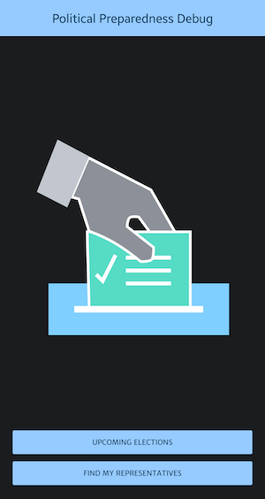
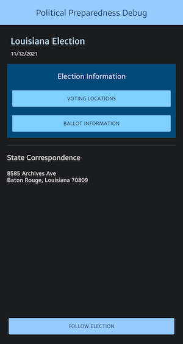

## Political Preparedness<br/> [](https://renovatebot.com/) [](https://app.codacy.com/gh/ryanw-mobile/nd940-cap-advanced-android-programming-project/dashboard?utm_source=gh&utm_medium=referral&utm_content=&utm_campaign=Badge_grade)

Political Preparedness is a Capstone project I have submitted for graduating from the Udacity
Android Developers Kotlin Nanodegree program in September 2021. As already being assessed in
previous coursework, Udacity did not award extra marks for writing tests in this project.

So I have followed a practical approach - by submitting what they have asked for in the rubric in
order to graduate. After graduation, now I keep on refactoring the codes, improving the UI layout
and adding tests to this project.

 
 
 


This app demonstrates the following views and techniques:

* [Retrofit](https://square.github.io/retrofit/) to make api calls to an HTTP web service.
* [Moshi](https://github.com/square/moshi) which handles the deserialization of the returned JSON to
  Kotlin data objects.
* [Glide](https://bumptech.github.io/glide/) to load and cache images by URL.
* [Room](https://developer.android.com/training/data-storage/room) for local database storage.
* [Coroutines](https://github.com/Kotlin/kotlinx.coroutines) as a substitution of RxJava for
  asynchronous/non-blocking tasks.
* [Dagger Hilt](https://dagger.dev/hilt/) for dependency injection
* [Timber](https://github.com/JakeWharton/timber) for logging
* [Truth](https://truth.dev/) - Assertion Library for Testing
* [Travis CI](https://travis-ci.org/) for Continuous Integration

It leverages the following components from the Jetpack library:

* [ViewModel](https://developer.android.com/topic/libraries/architecture/viewmodel)
* [LiveData](https://developer.android.com/topic/libraries/architecture/livedata)
* [Data Binding](https://developer.android.com/topic/libraries/data-binding/) with binding adapters
* [Navigation](https://developer.android.com/topic/libraries/architecture/navigation/) with the
  SafeArgs plugin for parameter passing between fragments

In addition the following features are included:

* Device permission
* Device location
* Dark theme support

## Setting up the keystore

* Android keystore is not being stored in this repository. You need your own keystore to generate
  the apk / App Bundle

* You need to have your own Civic API key from Google:
  the [Google Developers Console](https://console.developers.google.com/)

* To ensure sensitive data are not being pushed to Git by accident, the keystore and its passwords
  are kept one level up of the project folder, so they are not managed by Git.

* If your project folder is at `/app/nd940-cap/`, the keystore file and `keystore.properties`
  should be placed at `/app/`

* The format of `keystore.properties` is:
  ```
     store=/app/release-key.keystore
     alias=<alias>
     pass=<alias password>
     storePass=<keystore password>
     civicApiKey="<your API Key here>"
  ```

## Building the App

### Build and install on the connected device

   ```
   ./gradlew installDebug
   // or
   // ./gradlew installRelease
   ```

* Options are: `Debug`, `Release`
* Debug builds will have an App package name suffix `.debug`

### Build and sign a bundle for distribution

After August 2021, all new apps and games will be required to publish with the Android App Bundle
format.

   ```
   ./gradlew clean bundleRelease
   ```

### Build and sign an apk for distribution

   ```
   ./gradlew clean assembleRelease
   ```

* The generated apk(s) will be stored under `app/build/outputs/apk/`
* Other usages can be listed using `./gradelew tasks`
