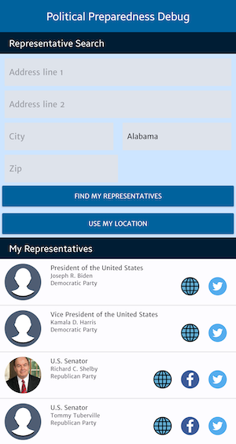

## Political Preparedness<br /> [](https://renovatebot.com/) [](https://app.codacy.com/gh/ryanw-mobile/nd940-cap-advanced-android-programming-project/dashboard?utm_source=gh&utm_medium=referral&utm_content=&utm_campaign=Badge_grade) [](https://app.codacy.com/gh/ryanw-mobile/nd940-cap-advanced-android-programming-project/dashboard?utm_source=gh&utm_medium=referral&utm_content=&utm_campaign=Badge_coverage)

Political Preparedness is a Capstone project I have submitted for graduating from the Udacity
Android Developers Kotlin Nanodegree program in September 2021. As already being assessed in
previous coursework, Udacity did not award extra marks for writing tests in this project.

So I have followed a practical approach - by submitting what they have asked for in the rubric in
order to graduate. After graduation, now I keep on refactoring the codes, improving the UI layout
and adding tests to this project.

 
 
 


## Binaries download

If you want to try out the app without building it, check out
the [Releases section](https://github.com/ryanw-mobile/nd940-cap-advanced-android-programming-project/releases) where you can find
the APK and App Bundles for each major version. A working Civic API key was applied when building
the app, therefore you can test it by just installing it.

&nbsp;

## To-do lists

Planned enhancements are
now [logged as issues](https://github.com/ryanw-mobile/nd940-cap-advanced-android-programming-project/issues?q=is%3Aopen+is%3Aissue+label%3Arefactor%2Cfeature%2Cfix%2Ctest).

&nbsp;

## High level architecture

* Kotlin
* Kotlin Coroutines and Flow
* MVVM & clean architecture
* XML Views
* Device permission
* Device location
* Dark theme support
* Dependency Injection using Dagger Hilt
* Gradle Kotlin DSL and Version Catalog
* Robolectric database tests

&nbsp;

## Major libraries used

### Dependencies

* [AndroidX Activity KTX](https://developer.android.com/jetpack/androidx/releases/activity) - Apache 2.0 - Extensions for Android Activity
* [AndroidX Core KTX](https://developer.android.com/jetpack/androidx/releases/core) - Apache 2.0 - Extensions for Android Core
* [AndroidX Core Testing](https://developer.android.com/jetpack/androidx/releases/arch-core) - Apache 2.0 - Core testing utilities
* [AndroidX Espresso](https://developer.android.com/training/testing/espresso) - Apache 2.0 - Espresso library for UI testing
* [AndroidX Fragment KTX](https://developer.android.com/jetpack/androidx/releases/fragment) - Apache 2.0 - Extensions for Android Fragment
* [AndroidX Fragment Testing](https://developer.android.com/jetpack/androidx/releases/fragment) - Apache 2.0 - Utilities for testing fragments
* [AndroidX Navigation Fragment KTX](https://developer.android.com/jetpack/androidx/releases/navigation) - Apache 2.0 - Navigation KTX for fragments
* [AndroidX Room](https://developer.android.com/jetpack/androidx/releases/room) - Apache 2.0 - Room database
* [ConstraintLayout](https://developer.android.com/jetpack/androidx/releases/constraintlayout) - Apache 2.0 - Constraint-based layout system
* [AndroidX Core Test KTX](https://developer.android.com/jetpack/androidx/releases/test) - Apache 2.0 - Core testing utilities for AndroidX
* [Glide](https://github.com/bumptech/glide) - BSD - Image loading and caching library
* [Hilt Android](https://dagger.dev/hilt) - Apache 2.0 - Dependency injection library for Android
* [Kotlin Standard Library](https://kotlinlang.org/api/latest/jvm/stdlib/) - Apache 2.0 - Standard library for Kotlin
* [JUnit](https://junit.org/junit4/) - Eclipse Public License 1.0 - Unit testing framework
* [Kotlin Reflect](https://kotlinlang.org/docs/reflection.html) - Apache 2.0 - Reflection library for Kotlin
* [Kotlinx Coroutines Android](https://github.com/Kotlin/kotlinx.coroutines) - Apache 2.0 - Coroutines support for Android
* [AndroidX Lifecycle LiveData KTX](https://developer.android.com/jetpack/androidx/releases/lifecycle) - Apache 2.0 - KTX extensions for LiveData
* [AndroidX Lifecycle ViewModel KTX](https://developer.android.com/jetpack/androidx/releases/lifecycle) - Apache 2.0 - KTX extensions for ViewModel
* [Material Components](https://material.io/develop/android) - Apache 2.0 - Material Design UI components
* [Mockito Core](https://site.mockito.org/) - MIT - Mocking framework for unit tests in Java
* [Moshi](https://github.com/square/moshi) - Apache 2.0 - JSON library for Android and Java
* [Play Services Location](https://developers.google.com/android/guides/overview) - Apache 2.0 - Location services from Google Play
* [Retrofit](https://square.github.io/retrofit/) - Apache 2.0 - Type-safe HTTP client for Android and Java
* [Robolectric](http://robolectric.org/) - Apache 2.0 - Unit testing framework for Android
* [Timber](https://github.com/JakeWharton/timber) - Apache 2.0 - Logging library for Android

### Plugins

* [Android Application Plugin](https://developer.android.com/studio/build/gradle-plugin-3-0-0-migration) - Google - Plugin for building Android applications
* [Jetbrains Kotlin Android Plugin](https://kotlinlang.org/docs/android.html) - JetBrains - Plugin for Kotlin Android projects
* [Hilt Android Plugin](https://dagger.dev/hilt) - Google - Plugin for Hilt Android dependency injection
* [Kover Plugin](https://github.com/Kotlin/kotlinx-kover) - JetBrains - Code coverage tool for Kotlin
* [Ktlint Plugin](https://github.com/JLLeitschuh/ktlint-gradle) - JLLeitschuh - Plugin for Kotlin linter
* [KSP Plugin](https://github.com/google/ksp) - Google - Kotlin Symbol Processing API
* [Android Test Plugin](https://developer.android.com/studio/build/gradle-plugin-3-0-0-migration) - Google - Plugin for Android test projects
* [Serialization Plugin](https://github.com/Kotlin/kotlinx.serialization) - JetBrains - Plugin for Kotlin serialization
* [Navigation Safe Args Plugin](https://developer.android.com/guide/navigation/navigation-pass-data#Safe-args) - AndroidX - Plugin for type-safe navigation

&nbsp;

## Building the App
### Requirements

* To build the app by yourself, you need your own [Civic API key from Google](https://console.developers.google.com/)

&nbsp;

### Setting up the keystore

Release builds will be signed if either the keystore file or environment variables are set.
Otherwise, the app will be built unsigned and without the Google Civic API key installed, which will not
pull any data from the endpoint.

### Local

* Android Keystore is not being stored in this repository. You need your own Keystore to generate
  the apk / App Bundle

* If your project folder is at `/app/nd940-cap/`, the Keystore file and `keystore.properties`
  should be placed at `/app/`

* The format of `keystore.properties` is:
  ```
     store=/app/release-key.keystore
     alias=<alias>
     pass=<alias password>
     storePass=<keystore password>
     civicApiKey="<your API Key here>"
  ```

### CI environment

* This project has been configured to support automated CI builds.

* The following environment variables have been set to provide the keystore:
  ```
     CI = true
     HOME = <the home directory of the bitrise environment>
     CI_ANDROID_KEYSTORE_PASSWORD = <your keystore password>
     CI_ANDROID_KEYSTORE_ALIAS = <your keystore alias>
     CI_ANDROID_KEYSTORE_PRIVATE_KEY_PASSWORD = <your keystore private key password>
     CIVIC_API_KEY <your API Key>
  ```

### Build and install on the connected device

This app has two build variants: `Debug` and `Release`. The most common build commands are:

* `./gradlew clean installDebug`
* `./gradlew clean instal`
* `./gradlew clean bundleRelease`
* `./gradlew clean assembleRelease`

The generated apk(s) will be stored under `app/build/outputs/`

&nbsp;
