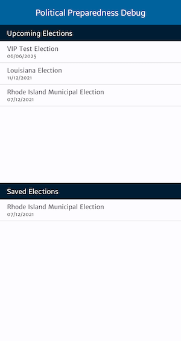
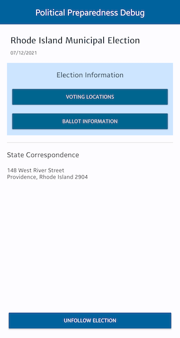

## Political Preparedness

Political Preparedness is a Capstone project I have submitted for graduating from the Udacity Android
Developers Kotlin Nanodegree program in September 2021.

 
 


This app demonstrates the following views and techniques:

* [Retrofit](https://square.github.io/retrofit/) to make api calls to an HTTP web service.
* [Moshi](https://github.com/square/moshi) which handles the deserialization of the returned JSON to
  Kotlin data objects.
* [Glide](https://bumptech.github.io/glide/) to load and cache images by URL.
* [Room](https://developer.android.com/training/data-storage/room) for local database storage.
* [Coroutines](https://github.com/Kotlin/kotlinx.coroutines) as a substitution of RxJava for
  asynchronous/non-blocking tasks.

It leverages the following components from the Jetpack library:

* [ViewModel](https://developer.android.com/topic/libraries/architecture/viewmodel)
* [LiveData](https://developer.android.com/topic/libraries/architecture/livedata)
* [Data Binding](https://developer.android.com/topic/libraries/data-binding/) with binding adapters
* [Navigation](https://developer.android.com/topic/libraries/architecture/navigation/) with the
  SafeArgs plugin for parameter passing between fragments

In addition the following features are included:

* Device permission
* Device location

## Running the App

As a project deliverable, the current code base has simplified greatly the build configurations. For
now you will have to build and run the App using Android Studio.

### API Keys

In order for this project to pull data, you will need to add your API Key to the project as a value
in the CivicsHttpClient. You can generate an API Key from
the [Google Developers Console](https://console.developers.google.com/)

Once you have the API key, you will need to generate a file `MyKeys.kt` at the project root, with
the following contents:

```
object MyKeys {
    const val KEY_CIVICAPI = your_key_here"
}
```

As the project has been submitted and marked, and I have graduated from the Nanodegree programme
already. This will be improved in the next version of the App, which serves as a skill
demonstration.